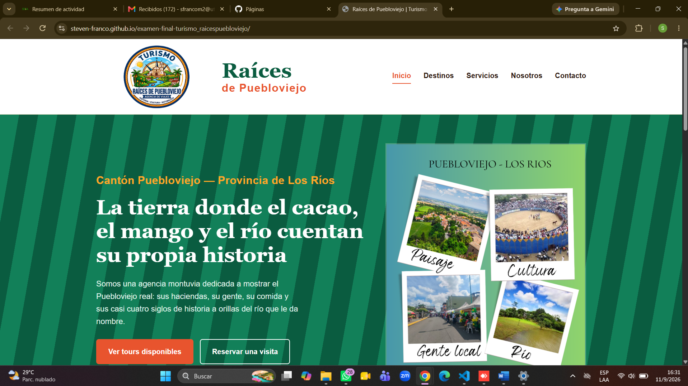

**Nombre del proyecto:**
Raíces de Puebloviejo — sitio web de agencia de turismo

**Nombre del estudiante:**
Steven Alejandro Franco Mantuano

**Destino turístico asignado:**
Puebloviejo, provincia de Los Ríos — Ecuador (enfoque: historia local, gastronomía, cultura y turismo rural)

**Descripción del proyecto:**
Sitio web de "Raíces de Puebloviejo", una agencia de turismo ficticia especializada en promocionar el cantón Puebloviejo (Los Ríos). El proyecto fue desarrollado como examen final de la asignatura, aplicando HTML5 semántico, CSS3 (box model, Flexbox, Grid, diseño responsive) y control de versiones con Git y GitHub.

El sitio presenta seis atractivos turísticos del cantón (Mango Tour, haciendas de cacao y banano, pesca deportiva en el río Puebloviejo, el museo y galería de personajes ilustres Puerto Pechiche y San Juan, y el centro histórico), seis paquetes turísticos con precios referenciales, la historia/misión/visión de la agencia y un formulario de contacto y reserva.

**Tecnologías utilizadas:**
HTML5 (estructura semántica, formularios, multimedia)
CSS3 (selectores, pseudo-clases, Flexbox, CSS Grid, diseño responsive con @media)
Git y GitHub
GitHub Pages para la publicación

**Captura del sitio:**

**URL del sitio publicado:**
https://steven-franco.github.io/examen-final-turismo_raicespuebloviejo/
